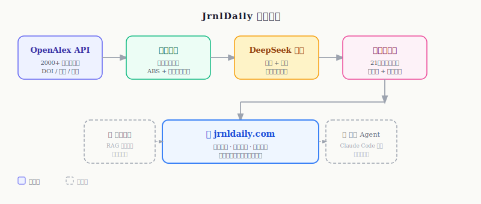
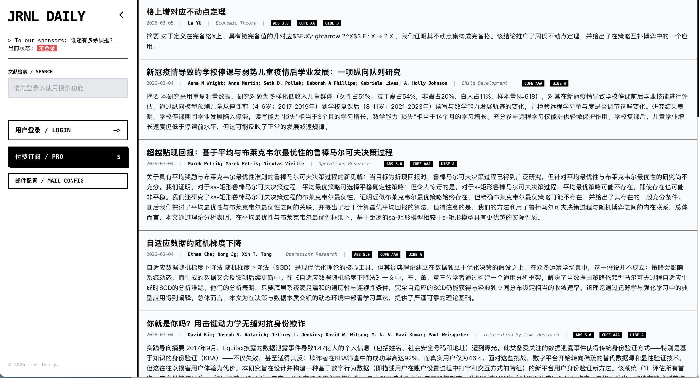
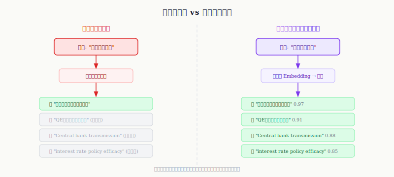

# 构建属于自己的经济学文献库：JRNL DAILY 上线

## 一个持续多年的研究痛点

查找阅读文献时，有两个问题始终困扰着我：

**第一个问题：如何实时获取国际期刊的最新动态？**

顶刊更新速度极快，除了每期固定更新外，每日都有新Accepted Papers在线发表，更遑论工作论文的持续涌现。靠手动刷期刊官网既低效又遗漏严重，各种文献推送服务要么覆盖面不全，要么推送逻辑不可控，真正适合经济学研究者的工具几乎是空白的。

**第二个问题：多语言检索的壁垒。**

母语是中文的研究者做英文文献检索，天然存在表述不匹配的问题——我脑子里想到的概念，对应的英文学术表达是什么？有没有日文、法文文献讨论过类似的东西？传统关键词搜索在跨语言这件事上根本无能为力。

这两个问题，在过去我只能靠勤勉和经验来弥补。直到最近，我决定自己动手，造一个轮子。

## AI 时代的学术研究：数据是新的基础设施

当前，以 Claude Code 为代表的 AI 编程工具正在重塑经济学的研究范式。越来越多的同行开始尝试搭建自己的科研 Agent，让 AI 帮助做文献综述、处理数据、跑回归、写初稿。

但是**AI Agent 的能力上限，在很大程度上取决于它能接触到的数据质量与深度**。没有结构化的、可查询的文献库，任何科研 Agent 都是无根之木。

所以，在搭建 Agent 之前，先把文献库这件基础设施做好，是更务实的选择。

## 我的解决方案

在数据来源方面，[OpenAlex](https://openalex.org/) 是一个完全开放的学术文献数据库，提供了覆盖面极广的 REST API，包含论文元数据、作者信息、期刊分类、引用关系等。更重要的是，它对程序化访问非常友好，没有繁琐的申请门槛。

根据 OpenAlex 的 API 文档，我规划了整套数据管线：

- **期刊目录**：以 **ABS Academic Journal Guide** 和多所大学的期刊目录为基准，筛选出约 2000 本经济学、金融学、管理学核心期刊；
- **历史数据**：抓取每本期刊 2000 年以来全部发表文章的元数据（标题、摘要、DOI、作者、发表时间、引用数等）；
- **每日增量更新**：设置定时任务，每日自动拉取各期刊的最新发表；
- **中文翻译**：调用 DeepSeek API，对全部文献的标题和摘要进行中文转译，建立双语索引。

整个流程如下图所示：

核心代码已开源，感兴趣的同学可以直接取用：

> 🔗 **[github.com/luzhiyu-econ/JrnlDailyCrawler](https://github.com/luzhiyu-econ/JrnlDailyCrawler)**

## 关于 JRNL DAILY 

所有这些工作最终汇聚到一个产品上：**[JRNL DAILY](https://jrnldaily.com)**。

目前平台已经实现了我规划的全部基础功能：
-  每日推送最新发表论文，按期刊分类浏览；
-  中英双语关键词检索；
-  覆盖 2000 本期刊、21 世纪以来全量发表记录。

由于个人算力和服务器资源有限，目前平台对使用设置了一定门槛。**如果你有兴趣体验，欢迎发邮件给我，我为你配置体验权限。**

## 还没解决的问题：语义搜索的缺失

坦白说，翻译+双语检索只是一个临时方案，并没有从根本上解决多语言检索的问题。

传统关键词搜索的逻辑是**字面匹配**：你输入"货币政策效果"，它只会返回标题或摘要里包含这几个字的文章。但"QE 对通胀预期的影响""Central bank transmission mechanism"这些语义相近的表达，就会被漏掉。

真正的解决方案应该是**语义向量搜索**，即 RAG（Retrieval-Augmented Generation）的核心思路：

具体来说，最优的实现路径是：

1. 对数据库中所有文献的**标题 + 摘要**，使用大模型计算词嵌入（Embedding），存入向量数据库；
2. 用户搜索时，对查询词进行实时 Embedding；
3. 在向量空间中做相似度匹配，返回语义最接近的结果。

这个方案在技术上并不复杂，各大向量数据库（Pinecone、Weaviate、pgvector 等）都有成熟支持。**但奇怪的是，目前学术文献领域几乎没有任何厂商在做这件事。** Web of Science、Scopus 的搜索逻辑还停留在十年前。这个空白我至今没想明白原因——是成本问题？是市场问题？还是大家都觉得不重要？

对我而言，这件事的算力成本并不低：2000 本期刊、20 余年积累，涉及的文献数量在数百万量级，全量 Embedding 需要可观的计算资源。所以这个功能短期内我可能不会推进，**等 Agent 框架搭好之后，再回来做这件事会更顺理成章**。

## 下一步计划

目前我的路线图大致如下：

- **近期**：持续维护 JRNL DAILY，完善期刊覆盖范围和推送逻辑；
- **中期**：搭建面向经济学研究的 AI Agent，核心能力包括文献综述自动化、实证设计辅助；
- **远期**：在 Agent 完成后，回过头来实现语义向量检索，真正打通多语言、跨表述的文献发现。

数据、工具、算力——这三件事缺一不可，我现在还在攒量的阶段。

*如有兴趣交流，或希望获取 jrnldaily.com 的体验权限，欢迎通过邮件联系我。爬虫代码已开源，欢迎 PR 和 issue。*

*更新于 2025 年 3 月 6 日*