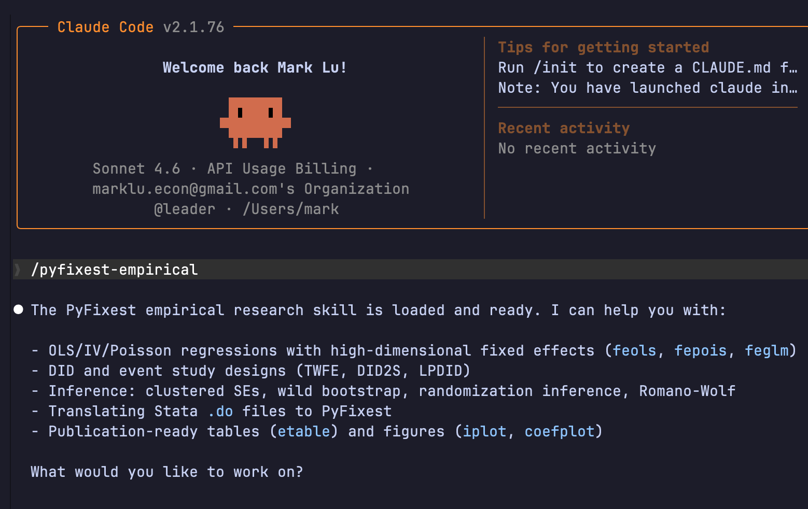
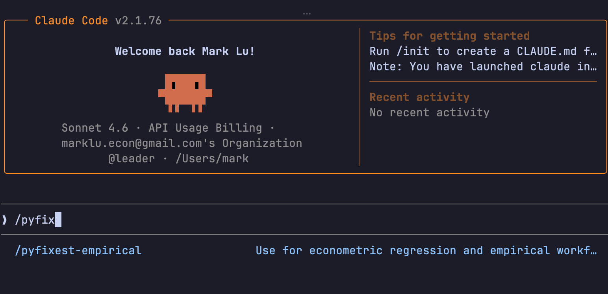

# 让 AI 正确使用 Python 进行实证回归

> 上一篇我们系统介绍了如何用 PyFixest 取代 Stata 做实证分析。这一篇解决下一个问题：**你学会了，但怎么让 AI 也写出规范的实证代码？**

---

## 目录

1. [问题：AI 写实证代码容易出什么错](#1-问题ai-写实证代码容易出什么错)
2. [根本原因：AI 没有实证规范约束](#2-根本原因ai-没有实证规范约束)
3. [解决方案：Skill 系统](#3-解决方案skill-系统)
4. [pyfixest-empirical skill 的内容](#4-pyfixest-empirical-skill-的内容)
5. [安装方法](#5-安装方法)
7. [获取与更新](#6-获取与更新)

---

## 1. 问题：AI 写实证代码容易出什么错

你已经掌握了 PyFixest 的语法，开始用 AI 辅助写回归脚本。但你很快发现：**AI 给的代码虽然能跑，但经不起审稿人的推敲。**

常见的问题类型：

### 标准误类型随意

```python
# AI 经常这样写——没有指定标准误，用默认的 iid
fit = pf.feols("Y ~ treatment | firm + year", data=df)
```

实证论文里这样写会被直接打回来。面板数据几乎必须聚类，但 AI 不知道你的识别策略，也不知道应该按哪个维度聚类。

### 忽略小样本校正差异

```python
# AI 认为这就等价于 Stata 的 reghdfe + cluster(firm)
fit = pf.feols("Y ~ X1 | firm + year", data=df, vcov={"CRV1": "firm"})
```

结果和 Stata 的数字对不上。原因在于 PyFixest 和 Stata 在双维聚类时默认用的自由度调整方法不同——AI 完全不知道这件事。

### IV 公式写法错误

```python
# AI 经常这样写，但 PyFixest 会报语法错误
fit = pf.feols("Y ~ | firm + year | endog ~ Z1 + Z2", data=df)

# 正确写法应该是
fit = pf.feols("Y ~ 1 | firm + year | endog ~ Z1 + Z2", data=df)
```

无外生控制变量时，第一部分不能为空，必须写 `1` 占位。AI 不知道这个 PyFixest 特有的语法规则。

### 聚类变量含缺失值未处理

```python
# AI 不会主动检查，但 PyFixest 会直接报错
fit = pf.feols("Y ~ X1", data=df, vcov={"CRV1": "cluster_var"})
# 如果 cluster_var 有 NaN → ValueError
```

Stata 对这个静默处理，PyFixest 不行。AI 按 Stata 逻辑写代码，就会踩坑。

### DID 事件研究忘记设定基准期

```python
# 没有 ref=-1，所有时期系数都会被估计，无法做预趋势检验
fit = pf.feols("Y ~ i(rel_year) | id + year", data=df)

# 必须明确指定参考期
fit = pf.feols("Y ~ i(rel_year, ref=-1) | id + year", data=df)
```

---

## 2. 根本原因：AI 没有实证规范约束

这些问题有一个共同来源：**AI 缺乏实证研究的规范意识。**

大语言模型的知识来自互联网上的代码和文档。它知道 PyFixest 的基础语法，但它不知道：

- 这段代码是给审稿人看的，不只是要能跑
- 面板数据的聚类方式需要对应识别策略
- 复现 Stata 结果需要特定的 SSC 设置
- PyFixest 有若干和 Stata 行为不一致的地方需要主动处理

更关键的是，AI 没有"实证工作流"的概念——**从基准回归、稳健性检验、异质性分析到 IV 诊断，每一步该做什么、该输出什么，它并不清楚。**

直接问 AI "帮我写一个 DID 回归"，它给你的是一个能跑的代码片段，不是一个经得起审查的实证流程。

---

## 3. 解决方案：Skill 系统

解决这个问题的方法是给 AI 配置一个**专用知识模块**，在它开始写实证代码之前，自动加载相关的规范和注意事项。

这就是 **Skill**——一种针对特定任务场景的持久化指令文件。

### Skill 是如何工作的



*图：用户发出实证任务请求 → AI 识别并加载 pyfixest-empirical skill → 按规范生成代码*

Skill 文件存放在固定位置（Claude Code 的 `~/.claude/skills/` 目录），当 AI 检测到你的请求涉及实证回归时，自动读取其中的规范约束和参考资料，然后再生成代码。

这个过程对用户完全透明——你只需要像平常一样提问，AI 会自动在内部走规范流程。

### 没有 Skill vs. 有 Skill

| | 没有 Skill | 有 pyfixest-empirical Skill |
|---|---|---|
| 标准误 | 随机给，可能用默认 iid | 询问识别策略，选择正确类型 |
| 聚类变量 | 不检查 NaN | 主动 dropna 后再传入 |
| Stata 结果对齐 | 不知道 SSC 差异 | 按需设置 `pf.ssc()` |
| IV 语法 | 容易写错占位符 | 遵循正确的三段式公式 |
| 事件研究 | 忘记 ref 参数 | 自动检查基准期设定 |
| 工作流 | 单点回答 | 按基准→稳健→异质性→诊断的流程组织 |

---

## 4. pyfixest-empirical skill 的内容

这个 skill 包含四个专题参考文件，按需加载，不会一次性占用所有上下文：

### 4.1 公式语法参考

涵盖 PyFixest 完整的公式语法体系：

- `|` 分隔符的三段式结构（因变量 / 固定效应 / IV）
- `csw0()` / `csw()` / `sw()` / `sw0()` 批量估计语法
- `i()` 事件研究交互项的正确写法
- `C()` 与固定效应吸收的区别
- 多因变量语法

### 4.2 Stata 对照手册

逐命令对照 Stata `reghdfe` / `ivreghdfe` / `ppmlhdfe`，覆盖：

- 基础 OLS、稳健标准误、聚类标准误
- 固定效应（单维/多维）
- IV/2SLS 完整工作流
- Poisson/PPML、GLM、分位数回归

### 4.3 推断方法指南

标准误类型和推断方法的完整菜单：

- HC1 / HC2 / HC3 适用条件
- CRV1 / CRV3 聚类与使用限制
- **SSC 小样本校正对照表**——复现 Stata 结果的关键
- Wild Bootstrap (`wildboottest`)
- 随机化推断 (`ritest`)
- Romano-Wolf 多重检验校正

### 4.4 DID / 事件研究指南

差分中差分和事件研究的完整规范：

- TWFE 基础设定与预趋势检验
- Gardner DID2S 两步估计法
- LPDID 局部投影法
- `event_study()` 统一 API 的使用方法
- `iplot()` 事件研究图的输出规范

### 4.5 可复用辅助脚本

`pyfixest_helpers.py` 提供一组实用函数：

```python
check_cluster_na(df, cluster_vars)   # 检查聚类变量缺失值
create_relative_time(df, event_col)  # 构造事件研究相对时间
diagnose_iv(fit_iv)                  # IV 诊断报告（第一阶段 F、有效 F）
compare_se_types(fit)                # 对比不同标准误类型的结果
export_etable_to_latex(fits, path)   # 快速导出 LaTeX 回归表
```

---

## 5. 安装方法

### Claude Code 用户

将 skill 克隆到 Claude Code 的全局 skills 目录，运行一次安装脚本即可：

```bash
git clone https://github.com/luzhiyu-econ/pyfixest-empirical ~/.claude/skills/pyfixest-empirical
cd ~/.claude/skills/pyfixest-empirical
./install.sh
```

重启 Claude Code 后生效。之后每次涉及 PyFixest 相关任务，skill 会自动触发。



*图：安装完成后，在 Claude Code 技能列表中可以看到 pyfixest-empirical*

### Codex 用户

将 skill 克隆到你的项目目录下：

```bash
cd /path/to/your-project
git clone https://github.com/luzhiyu-econ/pyfixest-empirical .codex/skills/pyfixest-empirical
cd .codex/skills/pyfixest-empirical
./install.sh
```

### 更新

```bash
cd ~/.claude/skills/pyfixest-empirical
git pull && ./install.sh
```

`install.sh` 是幂等的，重复运行安全。

---

## 6. 获取与更新

**GitHub 仓库：**
[github.com/luzhiyu-econ/pyfixest-empirical](https://github.com/luzhiyu-econ/pyfixest-empirical)

仓库包含完整的 skill 文件、参考手册和辅助脚本，MIT 许可，可自由使用和修改。

**相关文章：**

- 上一篇：[ALL in Python：如何使用 PyFixest 进行实证分析](/wiki/docs/research/Casual%20With%20Python)
- Claude Code Skills 系统介绍：[#4：Skills 设计](/wiki/docs/skills/Claude%20Code%204%20-%20Skills%20for%20Economics)

---

> **一个实用的工作方式：** 安装 skill 之后，不需要每次都解释"请用聚类标准误""记得做 IV 诊断"——只需要描述你的研究设计，AI 会自动按规范走完整个流程。Skill 做的事情，是把你的实证规范内化为 AI 的默认行为。
